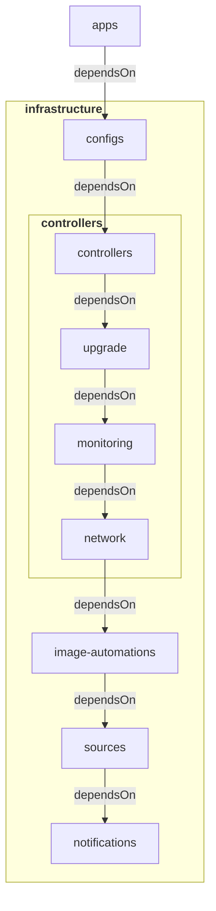

# (WIP) hetzner-k3s-flux-template - An opionated template for a K3s cluster implementing GitOps through Flux on Hetzner Cloud

This repository attempts to create a solid starting point for creating a fully fledged Flux managed K3s cluster on Hetzner Cloud.

## Table of contents

- [Overview](#overview)
- [Quickstart](#quickstart)
- [Considerations](#considerations)
- [Contributing](#contributing)
- [License](#license)

## Overview

This template is built on my general [`flux-template`](https://github.com/418Coffee/flux-template).

### Stack

All core components are optional, you can choose to only use the repository structure as a starting point.

<div align="center">
<table>
    <tr>
        <th>Name</th>
        <th>Description</th>
    </tr>
    <tr>
        <td><a href="https://fluxcd.io/">Flux</a></td>
        <td>Automated Kubernetes cluster updates using GitOps</td>
    </tr>
    <tr>
        <td><a href="https://github.com/getsops/sops">SOPS</a></td>
        <td>Secret management</td>
    </tr>
    <tr>
        <td><a href="https://cilium.io/">Cilium</a></td>
        <td>eBPF-based Networking, Observability, Security.</td>
    </tr>
    <tr>
        <td><a href="https://cert-manager.io/">cert-manager</a></td>
        <td>X.509 certificate management</td>
    </tr>
    <tr>
        <td><a href="https://kubernetes-sigs.github.io/external-dns/">ExternalDNS</a></td>
        <td>Synchronize exposed Kubernetes Services and Ingresses with DNS providers</td>
    </tr>
    <tr>
        <td><a href="https://traefik.io/traefik/">Traefik</a></td>
        <td>Edge Router / Ingress</td>
    </tr>
    <tr>
        <td><a href="https://github.com/gimlet-io/capacitor">Capacitor</a></td>
        <td>General purpose UI for Flux</td>
    </tr>
    <tr>
        <td><a href="https://github.com/prometheus-operator/kube-prometheus">kube-prometheus</a></td>
        <td>Monitoring stack, including Prometheus, Grafana, and Alertmanager</td>
    </tr>
    <tr>
        <td><a href="https://grafana.com/oss/loki/">Loki</a></td>
        <td>Log aggregation</td>
    </tr>
    <tr>
        <td><a href="https://grafana.com/docs/loki/latest/send-data/promtail/">Promtail</a></td>
        <td>Log discovery</td>
    </tr>
    <tr>
        <td><a href="https://kured.dev/">Kured</a></td>
        <td>Reboot Daemon</td>
    </tr>
    <tr>
        <td><a href="https://github.com/rancher/system-upgrade-controller">System Upgrade Controller</a></td>
        <td>Automated node updates</td>
    </tr>
    <tr>
        <td><a href="https://github.com/stakater/Reloader">Reloader</a></td>
        <td>Auto-reload Kubernetes resources based on ConfigMap/Secret changes</td>
    </tr>
</table>
</div>

### Flux Kustomization Reconciliation Flowchart



A fully set up repository structure is as follows:

### Top directories

- `apps`: user related deployments (e.g. webapps, game servers)
- `cluster`: Flux configuration
- `infrastructure`: common infrastructure components (e.g. monitoring, network)
- `templates`: yaml template files
- `tools`: workspace and template rendering

Flux is set up to only look at `apps`, `cluster` and `infrastructure`:

```
├── 📁 apps
│   └── kustomization.yaml
│  
├── 📁 cluster
│   ├── 📁 flux-system
│   ├── apps.yaml
│   └── infrastructure.yaml
|
└── 📁 infrastructure
    ├── 📁 configs
    ├── 📁 controllers
    ├── 📁 image-automations
    ├── 📁 notifications
    └── 📁 sources
```

#### Applications

The `apps` directory is very straightforward, you can structure it however you want as long as you mention the resource in the `kustomization.yaml` file.

#### Cluster

The `cluster` directory holds all the files necessary for Flux to work. The `flux-system` directory is generated after bootstrapping, the `apps.yaml` and `infrastructure.yaml` hold the Flux Kustomization definitions.

#### Infrastructure

The `infrastructure` is structured into 5 sub directories:

- `configs`: Kubernetes custom resources such as cert issuers and networks policies
- `controllers`: namespaces and Helm release definitions for Kubernetes controllers
- `image-automations`: [Image reflector and automation controllers](https://fluxcd.io/flux/components/image/)
- `notifications`: [Notification Controllers](https://fluxcd.io/flux/components/notification/)
- `sources`: [Source Controllers](https://fluxcd.io/flux/components/source/)

The `configs`, `image-automations`, `notifications` directories have no resources by default. For brevity, they are omitted from the following view:

```
📁 infrastructure
├── 📁 controllers
│   ├── 📁 monitoring
|   ├── 📁 network
|   ├── 📁 upgrade
|   ├── reloader.yaml
|   └── kustomization.yaml
│  
└── 📁 sources
    ├── 📁 bucket
    ├── 📁 git
    ├── 📁 oci
    ├── 📁 helmrepos
    └── kustomization.yaml
```

The `controllers` and `sources` directories have the following sub directories:

#### controllers

- `monitoring`: Monitoring controllers
- `network`: Network controllers
- `upgrade`: Upgrade controllers

#### sources

- `bucket`: [Buckets](https://fluxcd.io/flux/components/source/buckets/)
- `git`: [GitRepositories](https://fluxcd.io/flux/components/source/gitrepositories/)
- `oci`: [OCIRepositories](https://fluxcd.io/flux/components/source/ocirepositories/)
- `helmrepos`: [HelmRepositories](https://fluxcd.io/flux/components/source/helmrepositories/)

## Quickstart

Getting started is easy, the following guide uses GitHub as a Git server.

#### Prerequisites

- A (preferably clean) Kubernetes cluster that does not have Flux installed, can be any distribution. For local testing you can use something like [minikube](https://minikube.sigs.k8s.io/docs/), [kind](https://kind.sigs.k8s.io/), [microk8s](https://microk8s.io/), etc.
- [age](https://github.com/FiloSottile/age) for secret keys.
- [sops](https://github.com/getsops/sops) for encrypting secrets.
- [just](https://github.com/casey/just) for commands.
- [Docker](https://www.docker.com/) for a containerized work environment.

1. [Create a new Git repository by using this one as a template](https://github.com/new?template_name=flux-template&template_owner=418Coffee).

2. Create an age key that will be used for encrypting cluster based secrets:

```sh
age-keygen -o flux.agekey
```

Add the age secret key string (identity) `AGE-SECRET-KEY-1...` found in the file to the default identities file `~/.config/sops/age/keys.txt`.

3. Fill [`config.yaml`](https://github.com/418Coffee/flux-template/blob/main/config.yaml) with your age public key (recipient) and your controller values.

4. Add and encrypt the kubeconfig file:

You can choose to use a different age key to encrypt the kubeconfig (this key will not be pushed to the cluster). Make sure that the identity also exists in the default identities file (`~/.config/sops/age/keys.txt`).

```sh
sops -e -i --age age... --encrypted-regex '^client-key-data$' --input-type yaml --output-type yaml kubeconfig
config
```

5. Build workspace container:

```sh
just build
```

6. Run workspace container:

```sh
just tools
```

7. Render templates:

```sh
just render
```

8. Create a `flux-system` namespace and create the sops-age secret:

#### Create flux-system namespace:

```sh
kubectl create ns flux-system
```

#### Create sops-age secret:

```sh
cat flux.agekey | kubectl create secret generic sops-age \
   --namespace=flux-system \
   --from-file=age.agekey=/dev/stdin
```

9. Bootstrap Flux:

Generate a [GitHub PAT](https://docs.github.com/en/authentication/keeping-your-account-and-data-secure/managing-your-personal-access-tokens) that can create repositories by checking all permissions under `repo`.

#### Export values:

```sh
export GITHUB_TOKEN=<your-token>
export GITHUB_USER=<your-username>
export GITHUB_REPO=<your-repo>
```

#### Bootstrap:

```sh
flux bootstrap github \
 --components-extra=image-reflector-controller,image-automation-controller \
 --owner=$GITHUB_USER \
 --repository=$GITHUB_REPO \
 --branch=main \
 --path=cluster \
 --read-write-key \
 --personal
```

If you wish to create a public repository, add the --private=false flag.

10. Enjoy your cluster 🎉!

You know have a GitOps compliant cluster fully managed through a Git repository, the sky's the limit 🚀!

## Considerations

**_Why not a monorepo approach?_**

A monorepo is great in theory, dev, staging and prod in one repository with the ability for overlays to minimize duplicated resource declaration. In practice it gets tangled quick, there are a lot of nuances between different environments that can result in more complexity than structure.

**_Why not use X for Y?_**

That's for YOU to decide, this is only meant as a foundation for your own cluster/templates. You can choose to not install any core component and roll with your own.

## Contributing

Pull requests are welcome. For major changes, please open an issue first to discuss what you would like to change.

## License

[MIT](https://choosealicense.com/licenses/mit/)

## Acknowledgements

This "solution" could not have been without the following OSS:

- [kronform](https://github.com/MathiasPius/kronform)
- [home-ops](https://github.com/onedr0p/home-ops)
